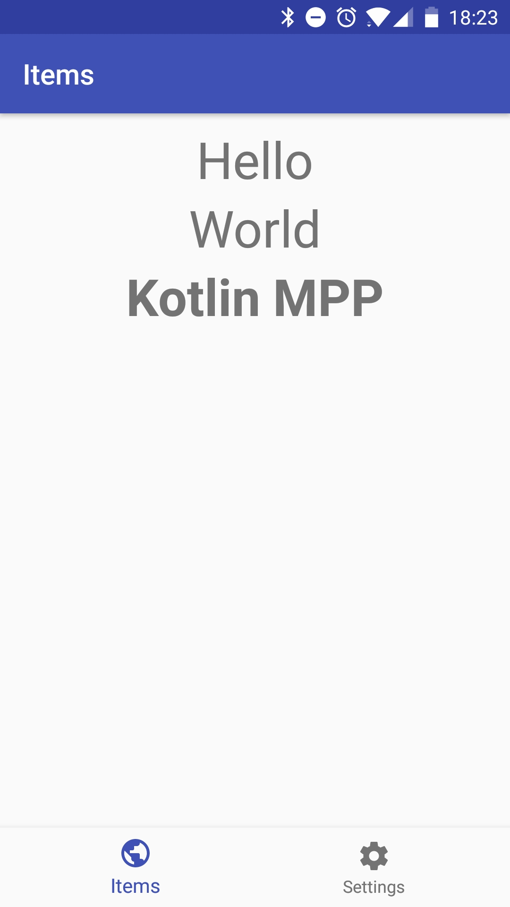
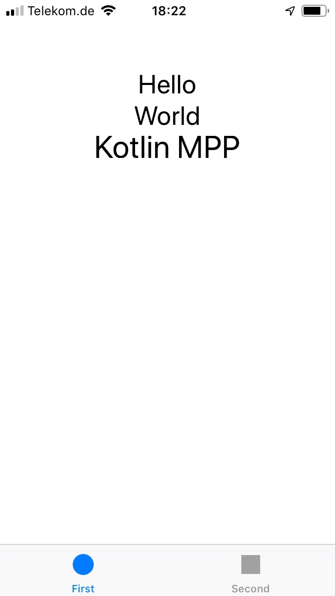
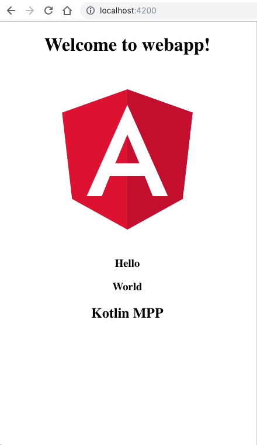

# Kotlin MPP-Template

Kotlin Multiplatform Project Template - **under development**!

- Android App
- iOS App
- WebApp (Angular)
 
All sharing the same common code.

- Uses the SOLID principles and most common clean architecture ideas.
- Uses kotlin coroutines but not in a clear thoughtful way (under development)

